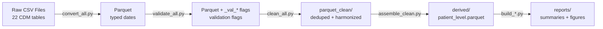

# Phase 1: Documentation & Baseline - Research

**Researched:** 2026-03-17
**Domain:** Python code documentation, golden file testing, data pipeline documentation
**Confidence:** HIGH

## Summary

Phase 1 focuses on documenting the existing ~10,500-line Polars-based clinical data pipeline and establishing golden output baselines for regression protection. The pipeline transforms 22 OneFlorida+ PCORnet CDM tables through five phases: CSV-to-Parquet conversion, validation, cleaning, deduplication, and reporting. Research confirms that Google-style docstrings are well-established for Python (PEP 257 foundation), golden file testing has mature tooling (pytest-golden, pytest-regressions), and SHA256-based manifest systems are industry standard for data integrity verification without exposing PHI.

The codebase structure is clear: `src/` contains modules (`load/`, `clean/`, `validate/`, `report/`) with ~6,400 lines, and `scripts/` contains orchestration scripts with ~4,100 lines. Existing documentation includes `docs/CODEBOOK.md` (100+ lines), `docs/PAYER_VARIABLES_AND_CATEGORIES.md`, and `docs/FLAG_CODES.md`, providing a foundation for the comprehensive `PIPELINE.md` required by DOC-03.

**Primary recommendation:** Use standard Python documentation tooling (Google-style docstrings per PEP 257), implement a SHA256-based golden manifest system stored in git with actual outputs gitignored, and structure PIPELINE.md with Mermaid flowcharts plus phase-by-phase detail sections for the 5-phase pipeline architecture.

<user_constraints>
## User Constraints (from CONTEXT.md)

### Locked Decisions

**Docstring depth:**
- Google-style docstrings on ALL functions (public, private, helpers — no exceptions)
- Brief clinical rationale: one sentence of "why" in the docstring (e.g., "Derives effective payer because dual-eligible patients need primary payer for billing"), with full clinical context reserved for PIPELINE.md
- Side effects (file writes, DataFrame mutations, prints) mentioned naturally in the description paragraph, not a separate section
- Parameters, returns, and types documented for every function

**Pipeline doc structure:**
- Claude decides the overall organization based on what fits the codebase best
- Include Mermaid diagrams for data flow visualization (renders on GitHub)
- Summary-level descriptions in the main flow, with linked/expandable sections for column-level detail (columns, dtypes, shape changes per stage)
- Known quirks and gotchas collected in a separate "Known Issues" section at the end, not inline with the main flow

**Golden output strategy:**
- Store checksums (SHA256), schemas (columns + dtypes), and row counts in a committed manifest — no actual patient data in the repo
- Real output files captured locally but gitignored — enables local regression comparison without PHI exposure
- Automated capture script (e.g., `scripts/capture_golden.py`) that reads existing pipeline outputs and records the manifest; rerunnable when baseline needs updating
- Claude decides which pipeline outputs get golden file treatment based on regression detection value

**Handling unknowns:**
- Both: TODO(audit) comments in source code for local visibility + collected list in `docs/AUDIT_LOG.md` for overview
- Claude categorizes unknowns by severity based on potential impact to data correctness
- Hardcoded values (magic numbers, sentinel values like 999, filter thresholds): research and explain with best-guess documentation, flagging confidence level
- Document actual behavior in docstrings (what the code DOES), not intended behavior — flag suspected bugs separately
- Claude decides when to check git history for context on unclear code
- Claude decides whether to include recommended actions in audit log entries

### Claude's Discretion

- Overall PIPELINE.md organization structure (narrative vs phase-by-phase vs module-by-module)
- Which specific pipeline outputs get golden file treatment
- Severity categorization for unknowns (HIGH/MEDIUM/LOW based on data correctness impact)
- Whether to include recommended actions in audit log entries
- When to consult git history for context
- How unknowns feed into Phase 2/3 planning

### Deferred Ideas (OUT OF SCOPE)

None — discussion stayed within phase scope

</user_constraints>

<phase_requirements>
## Phase Requirements

| ID | Description | Research Support |
|----|-------------|-----------------|
| DOC-01 | All public functions have Google-style docstrings explaining purpose, args, returns, and clinical rationale | **Standard Stack:** PEP 257 + Google Style Guide; **Patterns:** Side effect documentation, clinical rationale integration; **Examples:** Real Python, Google Style Guide |
| DOC-02 | All modules have module-level docstrings explaining what the module does and how it fits in the pipeline | **Standard Stack:** PEP 257 module docstrings; **Patterns:** Module-level overview with pipeline context; **Examples:** Existing codebase has examples in `src/load/convert.py` |
| DOC-03 | Pipeline overview document (docs/PIPELINE.md) covering full data flow from raw CSV to final outputs | **Architecture Patterns:** Mermaid data flow diagrams, phase-by-phase structure; **Standard Stack:** Markdown + Mermaid (GitHub renders natively); **Patterns:** Summary-level + detail sections for 5-phase pipeline |
| BASE-01 | Golden output files captured before any changes for regression comparison | **Standard Stack:** SHA256 manifest with pytest-golden or custom script; **Don't Hand-Roll:** Use hashlib.file_digest, not manual hash generation; **Patterns:** Manifest in git, actual files gitignored per HIPAA/PHI requirements |

</phase_requirements>

## Standard Stack

### Core

| Library | Version | Purpose | Why Standard |
|---------|---------|---------|--------------|
| Python | 3.11+ | Runtime environment | Project already uses 3.11 per `pyproject.toml` |
| Polars | Latest | DataFrame operations | Already core to pipeline; all code uses `pl.DataFrame` |
| hashlib | stdlib | SHA256 checksum generation | Python standard library; proven secure hashing (SHA256 recommended for 2026 per NIST, avoiding deprecated MD5/SHA1) |
| pathlib | stdlib | File path operations | Python standard library; modern path handling |

### Supporting

| Library | Version | Purpose | When to Use |
|---------|---------|---------|-------------|
| pytest-golden | 0.2.2+ | Golden file testing framework | Optional — only if automated regression tests needed (Phase 3); not required for Phase 1 manifest capture |
| pytest-regressions | 3.0+ | Golden file snapshots | Alternative to pytest-golden; supports JSON, CSV, NumPy arrays, DataFrames |
| json | stdlib | Manifest file format | For storing golden manifest (SHA256 + schema + row counts) |
| tabulate | Already installed | Report formatting | Already in environment.yml pip dependencies |

### Alternatives Considered

| Instead of | Could Use | Tradeoff |
|------------|-----------|----------|
| JSON manifest | YAML manifest | YAML more human-readable but requires extra dependency (PyYAML); JSON is stdlib |
| Custom capture script | pytest-golden/regressions | pytest plugins are more feature-rich but add complexity; custom script is simpler for one-time baseline capture and doesn't require test framework integration |
| SHA256 | MD5 or SHA1 | MD5/SHA1 have known collision vulnerabilities (deprecated for security use in 2026); SHA256 is NIST-recommended and suitable for HIPAA/SOC 2 compliance |

**Installation:**

No new dependencies required for Phase 1 — all tools are Python stdlib or already in `environment.yml`. Optional pytest plugins can be added later in Phase 3:

```bash
# Optional for Phase 3 regression testing
pip install pytest-golden pytest-regressions
```

## Architecture Patterns

### Recommended Project Structure

The codebase already follows best practices:

```
src/
├── load/              # CSV → Parquet conversion, config, schema resolution
├── clean/             # Deduplication, harmonization, flags
│   └── validate/      # Structural, cohort, value validation
├── report/            # Quality reports, summaries, figures
└── validate/          # Cross-module validation utilities

scripts/               # Pipeline orchestration scripts
├── convert_all.py     # Phase 2: CSV → Parquet
├── validate_*.py      # Phase 3-4: Validation
├── clean_all.py       # Phase 5: Cleaning + dedup
├── assemble_clean.py  # Phase 6: Patient-level assembly
└── build_*.py         # Phase 7+: Report generation

docs/                  # Documentation (to be expanded)
├── CODEBOOK.md        # Variable definitions (exists)
├── PIPELINE.md        # Full pipeline flow (to be created - DOC-03)
└── AUDIT_LOG.md       # Unknowns and TODOs (to be created)
```

### Pattern 1: Google-Style Docstrings with Clinical Rationale

**What:** PEP 257-compliant docstrings with Google conventions, extended with clinical "why" context

**When to use:** ALL functions (public, private, helpers) per user requirements

**Example:**

```python
def _collapse_payer_category(code: str) -> str:
    """Map PAYER_TYPE_PRIMARY to collapsed category for analysis.

    Collapses PCORnet's 9 payer type prefixes (1=Medicare, 2=Medicaid,
    5/6=Private, etc.) into 8 reporting categories. Treats NI/UN/OT and
    missing values as "Unknown" because they cannot be reliably classified.
    Returns "Unavailable" for 99/9999 sentinel values which indicate data
    was not collected (distinct from "Unknown" where collection was attempted
    but unsuccessful).

    This categorization supports insurance equity analysis by grouping payer
    types into policy-relevant categories (e.g., public vs private coverage).

    Mutates nothing; returns new string.

    Args:
        code: PCORnet PAYER_TYPE_PRIMARY value (e.g., "1", "21", "562")

    Returns:
        Category string: "Medicare", "Medicaid", "Private",
        "Other government", "No payment / Self-pay", "Other",
        "Unavailable", or "Unknown"
    """
    # Implementation...
```

**Source:** [Google Python Style Guide](https://google.github.io/styleguide/pyguide.html), [PEP 257](https://peps.python.org/pep-0257/)

### Pattern 2: Module-Level Pipeline Context Docstrings

**What:** Module docstring explaining what the module does AND how it fits in the 5-phase pipeline

**When to use:** Every `src/` and `scripts/` module

**Example:**

```python
# HL data loading & cleaning — partner harmonization & insurance consistency
"""Partner-level provenance flags and insurance enrollment coverage checks.

This module is part of Phase 5 (Cleaning) in the pipeline. After deduplication
(src/clean/dedup.py), it adds partner provenance flags (ICD_MAPPED, CLAIMS_ONLY,
DEATH_ONLY) based on SOURCE column and insurance consistency flags checking if
encounters fall within enrollment periods.

Adds binary flag columns (0/1, Int8) to DataFrames. Partner flags use direct
names (ICD_MAPPED, CLAIMS_ONLY, DEATH_ONLY); insurance consistency flags use
the ``_con_`` infix naming convention.

Input: Parquet files from parquet_dir (post-dedup)
Output: Parquet files with added flag columns (written by clean_all.py)
Key functions: add_partner_flags(), flag_encounters_outside_enrollment()
"""
```

**Source:** [PEP 257](https://peps.python.org/pep-0257/), [Real Python Docstring Guide](https://realpython.com/documenting-python-code/)

### Pattern 3: Side Effect Documentation (Natural Integration)

**What:** Mention mutations, file I/O, prints in the description paragraph (NOT a separate "Side Effects:" section)

**When to use:** Any function with side effects

**Example:**

```python
def write_cleaned(
    df: pl.DataFrame,
    output_path: Path,
    table_name: str,
) -> None:
    """Write cleaned DataFrame to Parquet with small-cell suppression report.

    Writes df to output_path as Parquet. Prints progress message to stdout
    showing table name, output path, row count, and any small-cell
    suppression applied. Creates parent directories if they don't exist.

    Used in Phase 5 cleaning to persist deduplicated + flagged data.

    Args:
        df: Cleaned DataFrame with flag columns
        output_path: Destination Parquet file path
        table_name: CDM table name for progress message
    """
    # Implementation...
```

**Source:** [Google Python Style Guide](https://google.github.io/styleguide/pyguide.html), [PEP 257](https://peps.python.org/pep-0257/)

### Pattern 4: Mermaid Data Flow Diagrams in Markdown

**What:** Flowchart diagrams showing pipeline phase transitions, rendered natively on GitHub

**When to use:** In `docs/PIPELINE.md` to visualize the 5-phase pipeline flow

**Example:**

```markdown
## Pipeline Architecture



### Phase Detail

Each phase transforms data through distinct operations...
\```

**Source:** [GitHub Mermaid Documentation](https://docs.github.com/en/get-started/writing-on-github/working-with-advanced-formatting/creating-diagrams), [Mermaid Official Docs](https://mermaid.ai/open-source/syntax/flowchart.html)

### Pattern 5: SHA256 Manifest for Golden Files (No PHI in Git)

**What:** JSON manifest storing file checksums, schemas, and row counts — actual data files gitignored

**When to use:** Baseline capture for regression detection (BASE-01)

**Example:**

```python
# scripts/capture_golden.py
import hashlib
import json
from pathlib import Path
import polars as pl

def capture_golden_manifest(output_dir: Path, manifest_path: Path) -> dict:
    """Capture golden file manifest with checksums and schemas.

    Reads all Parquet files in output_dir and generates a JSON manifest
    containing SHA256 checksums, schemas (column names + dtypes), and
    row counts. Actual data never written to manifest (HIPAA compliance).
    Writes manifest to manifest_path for git commit.

    Used to establish baseline for regression detection before pipeline
    changes. Rerun after intentional output changes to update baseline.

    Args:
        output_dir: Directory containing pipeline output Parquet files
        manifest_path: Path to write JSON manifest (e.g., .golden/manifest.json)

    Returns:
        Dict with structure: {filename: {sha256, schema, row_count, size_bytes}}
    """
    manifest = {}
    for parquet_file in output_dir.rglob("*.parquet"):
        # Compute SHA256 using stdlib hashlib (efficient chunked reading)
        with open(parquet_file, "rb") as f:
            file_hash = hashlib.file_digest(f, "sha256").hexdigest()

        # Read schema without loading data
        schema = pl.read_parquet_schema(parquet_file)
        df_shape = pl.scan_parquet(parquet_file).select(pl.len()).collect()

        manifest[str(parquet_file.relative_to(output_dir))] = {
            "sha256": file_hash,
            "schema": {col: str(dtype) for col, dtype in schema.items()},
            "row_count": df_shape[0, 0],
            "size_bytes": parquet_file.stat().st_size,
        }

    manifest_path.parent.mkdir(parents=True, exist_ok=True)
    manifest_path.write_text(json.dumps(manifest, indent=2))
    return manifest
```

**Manifest structure:**

```json
{
  "parquet_clean/DIAGNOSIS.parquet": {
    "sha256": "a3f5b8c...",
    "schema": {
      "PATID": "String",
      "DX": "String",
      "DX_DATE": "Date",
      "IS_DUPLICATE": "Int8"
    },
    "row_count": 45032,
    "size_bytes": 1048576
  }
}
```

**.gitignore additions:**

```gitignore
# Golden files (local comparison only - contains PHI)
derived/
parquet_clean/
reports/*.csv
reports/*.png

# Golden manifest (committed - no PHI)
!.golden/manifest.json
```

**Source:** [Python hashlib Docs](https://docs.python.org/3/library/hashlib.html), [How to Verify File Integrity](https://thepythoncode.com/article/verify-downloaded-files-with-checksum-in-python), [HIPAA Logging Pipelines 2026](https://www.konfirmity.com/blog/hipaa-logging-pipelines-for-hipaa)

### Anti-Patterns to Avoid

- **Docstrings only on public functions:** User requires ALL functions documented (public, private, helpers)
- **Clinical rationale in PIPELINE.md only:** Brief clinical "why" (one sentence) goes in docstrings; full context in PIPELINE.md
- **Separate "Side Effects:" section:** Integrate side effect documentation naturally in the description paragraph
- **Hand-rolling hash functions:** Use `hashlib.file_digest()` (Python 3.11+) for efficient chunked SHA256
- **Committing actual data files:** Golden manifest only (checksums + schemas); actual Parquet/CSV files gitignored per HIPAA
- **YYYYMMDD for non-date fields:** Date detection has false positive risk; already handled in `src/load/convert.py` with name heuristics

## Don't Hand-Roll

| Problem | Don't Build | Use Instead | Why |
|---------|-------------|-------------|-----|
| SHA256 file hashing | Manual chunk reading + hashlib.update() loop | `hashlib.file_digest(f, "sha256")` (Python 3.11+) | Stdlib function handles chunking, buffering, and memory efficiency; less error-prone |
| Polars schema inspection | Load full DataFrame just to check dtypes | `pl.read_parquet_schema()` for schema, `pl.scan_parquet().select(pl.len())` for row count | Avoids loading actual data into memory; critical for large clinical datasets |
| Docstring format invention | Custom docstring style | Google-style (already used in codebase) per PEP 257 | Consistency; tooling support (Sphinx Napoleon extension, IDE parsing) |
| Mermaid alternatives | ASCII art, hand-drawn diagrams | Mermaid code blocks in Markdown | GitHub/GitLab render natively; version-controllable; easier to maintain than images |
| Manifest file format | Custom binary format, pickle | JSON (stdlib) | Human-readable, git-friendly diffs, no security issues (unlike pickle), stdlib support |

**Key insight:** Clinical data pipelines have unique constraints (PHI protection, large file sizes, data integrity auditing) that make "just load it into memory" approaches dangerous. Use lazy evaluation (`scan_parquet`), schema-only reads, and checksum-based verification to avoid PHI exposure and memory issues.

## Common Pitfalls

### Pitfall 1: Committing PHI to Git Repository

**What goes wrong:** Actual pipeline output files (Parquet, CSV) contain protected health information and must NEVER be committed to version control, even in private repos

**Why it happens:** Golden file testing tutorials often show committing expected output files directly; this is acceptable for non-sensitive data but catastrophic for HIPAA-regulated clinical data

**How to avoid:**
- Use manifest-only approach: commit checksums + schemas + row counts, gitignore actual files
- Add `derived/`, `parquet_clean/`, `reports/*.csv`, `reports/*.png` to `.gitignore`
- Use `!.golden/manifest.json` to explicitly allow manifest commit
- Review git status before every commit to ensure no PHI files staged

**Warning signs:**
- `.parquet` or `.csv` files appearing in `git status`
- Large file warnings from git
- Git repo size growing significantly after commits

**Source:** [HIPAA Compliance 2026](https://cookie-script.com/privacy-laws/hipaa-guide-2026), [2026 HIPAA Updates](https://www.chesshealthsolutions.com/2025/11/06/2026-hipaa-rule-updates-what-healthcare-providers-administrators-and-compliance-officers-need-to-know/)

### Pitfall 2: Vague Clinical Rationale ("Used for analysis")

**What goes wrong:** Docstrings say "Used for billing analysis" without explaining WHY the specific logic exists, making it impossible to verify correctness or modify safely

**Why it happens:** Developer documents WHAT the code does (easy to see from reading code) instead of WHY it's designed this way (clinical/policy context)

**How to avoid:**
- Ask "Why this threshold?" for magic numbers (e.g., "30-day window for payer-at-treatment")
- Ask "Why fallback to secondary?" for conditional logic (e.g., dual-eligible detection)
- Ask "Why exclude this?" for filters (e.g., sentinel values 99/9999)
- Document the clinical/policy reasoning in one sentence in the docstring
- Put full clinical context in `docs/PIPELINE.md` or `docs/PAYER_VARIABLES_AND_CATEGORIES.md`

**Warning signs:**
- Docstring just repeats function name in prose ("Collapses payer category" for `_collapse_payer_category()`)
- Magic numbers uncommented
- Conditional logic without explanation of edge cases
- Filter conditions without clinical justification

**Example (BAD):**
```python
def _collapse_payer_category(code: str) -> str:
    """Collapse payer category. Returns category string."""
    # Just restates what function name already says
```

**Example (GOOD):**
```python
def _collapse_payer_category(code: str) -> str:
    """Map PAYER_TYPE_PRIMARY to collapsed category for analysis.

    Collapses PCORnet's 9 payer type prefixes into 8 reporting categories.
    Treats 99/9999 as "Unavailable" (distinct from "Unknown") because these
    are sentinel values indicating data was never collected, which is
    clinically distinct from collection attempts that failed (NI/UN/OT).
    This distinction matters for insurance equity analysis where missing
    data patterns may indicate systematic collection gaps.

    Args:
        code: PCORnet PAYER_TYPE_PRIMARY value

    Returns:
        Category: "Medicare", "Medicaid", "Private", etc.
    """
```

**Source:** [Google Python Style Guide](https://google.github.io/styleguide/pyguide.html), [Documenting Python Code](https://realpython.com/documenting-python-code/)

### Pitfall 3: Incomplete Pipeline Documentation (Missing Data Transformations)

**What goes wrong:** Pipeline documentation shows high-level flow ("CSV → Parquet → Cleaned") but omits critical transformation details like which columns are added, which are dropped, shape changes, dtype conversions

**Why it happens:** Documentation focuses on script execution order (easy) instead of data shape evolution (harder but more valuable)

**How to avoid:**
- Document input/output for EACH phase: columns added, columns dropped, dtype changes, row count changes
- Use "before/after" schema comparisons: "Input: 45 columns (all String), Output: 48 columns (+3 flags: IS_DUPLICATE, ICD_MAPPED, CLAIMS_ONLY), 12 date columns typed as Date"
- Document aggregations: "Input: encounter-level (1M rows), Output: patient-level (50K rows)"
- Create a transformation summary table in PIPELINE.md showing cumulative column additions per phase
- Link to code for detail: "See `src/clean/dedup.py::flag_duplicates()` for dedup logic"

**Warning signs:**
- PIPELINE.md has flowchart but no column-level detail
- Transformation sections say "various cleaning operations" without listing specific operations
- No mention of row count changes from aggregations
- No schema evolution tracking across phases

**Example structure for PIPELINE.md:**

```markdown
### Phase 5: Cleaning & Deduplication

**Script:** `scripts/clean_all.py`
**Input:** `parquet/` (22 tables, validated)
**Output:** `parquet_clean/` (22 tables, deduplicated + flagged)

**Transformations:**
- Add `IS_DUPLICATE` (Int8): 1 if row shares composite key with another row
- Add partner flags (Int8): `ICD_MAPPED`, `CLAIMS_ONLY`, `DEATH_ONLY`
- Add consistency flags (Int8): `_con_outside_encounter`, `_con_outside_enrollment`, `_con_no_enrollment`
- Add diagnosis flags (Int8): `FLAG_HL_DX`, `FLAG_SURVIVORSHIP_DX`
- Add provider flag (Int8): `FLAG_CANCER_PROVIDER`

**Schema changes:**
- DIAGNOSIS: 45 columns → 50 columns (+5 flags)
- ENCOUNTER: 38 columns → 42 columns (+4 flags)
- (Other tables similar)

**Row count:** Unchanged (flagging only, no filtering)

**Key functions:**
- `src/clean/dedup.py::flag_duplicates()` - composite key deduplication
- `src/clean/harmonize.py::add_partner_flags()` - partner provenance
- `src/clean/harmonize.py::flag_encounters_outside_enrollment()` - enrollment consistency

<details>
<summary>Column-level detail for DIAGNOSIS table</summary>

| Column | Type | Added in Phase | Description |
|--------|------|----------------|-------------|
| IS_DUPLICATE | Int8 | 5 (Clean) | 1 if (ID, DX_DATE, DX) composite key duplicated |
| ICD_MAPPED | Int8 | 5 (Clean) | 1 if SOURCE in {AMS, UMI} (retrospective mapping) |
| FLAG_HL_DX | Int8 | 5 (Clean) | 1 if DX in HL cohort codes (149 codes) |
| ... | ... | ... | ... |

</details>
```

**Source:** [Python Data Pipeline Best Practices](https://www.domo.com/glossary/data-pipelines-in-python), [Polars Pipeline Documentation](https://endjin.com/blog/2026/01/polars-faster-pipelines-simpler-infrastructure-happier-engineers)

### Pitfall 4: TODO Comments Without Audit Trail

**What goes wrong:** Code accumulates `# TODO: check if this is right` comments that never get addressed because there's no central tracking

**Why it happens:** TODOs are added during development but not systematically reviewed or prioritized

**How to avoid:**
- Use structured TODO format: `# TODO(audit): <description>` for audit-worthy items
- Create `docs/AUDIT_LOG.md` collecting all TODO(audit) items with severity categorization
- Add file location, line number, and context to audit log entries
- Categorize by severity: HIGH (affects data correctness), MEDIUM (affects usability), LOW (nice-to-have)
- Review audit log before Phase 2/3 to prioritize validation/testing

**Warning signs:**
- Scattered `# TODO` or `# FIXME` comments in code
- No central tracking of unknowns
- Uncertainty about data correctness without way to prioritize investigation
- "I think this is right but not sure" comments without follow-up

**Example audit log structure:**

```markdown
# Audit Log: Unknowns & Technical Debt

**Created:** 2026-03-17 (Phase 1 documentation)
**Purpose:** Track unknowns discovered during documentation for validation/testing in Phase 2/3

## HIGH Severity (Data Correctness Impact)

### AUDIT-001: Sentinel value 999 in payer fields not consistently handled

**Location:** `src/report/encounter_payer_summary.py:28`
**Issue:** `INCLUDE_99_AS_SENTINEL` flag exists but defaults to False. Unclear if 99/9999 should trigger fallback to secondary payer or be treated as valid "Unavailable" category.
**Impact:** May incorrectly categorize some patients' insurance status
**Confidence:** MEDIUM - user decision, not bug
**Recommended action:** Validate with domain expert; add tests for 99/9999 handling
**Phase 2/3 follow-up:** Add to TEST-01 (payer logic tests)

---

### AUDIT-002: Date parsing mixed format handling

**Location:** `src/load/convert.py:81-100`
**Issue:** `detect_date_columns()` uses 30% match threshold for name+value heuristic, 50% for value-only. Thresholds are reasonable but not validated empirically.
**Impact:** May miss some date columns or false-positive on numeric codes
**Confidence:** LOW - thresholds seem reasonable but unverified
**Recommended action:** Sample 10 tables, manually verify all date columns detected correctly
**Phase 2/3 follow-up:** Add to TEST-02 (date parsing tests); validate in Phase 2

## MEDIUM Severity (Usability Impact)

### AUDIT-003: Incomplete progress messages in clean_all.py

...

## LOW Severity (Nice-to-Have)

...
```

**Source:** [Technical Debt Tracking Tools 2026](https://www.codeant.ai/blogs/tools-measure-technical-debt), [Python Technical Debt Patterns](https://github.com/openstack/debtcollector)

### Pitfall 5: Hardcoded Paths and Magic Values

**What goes wrong:** Paths like `"C:/data/hl"` or thresholds like `30` (days) hardcoded in functions make code fragile and hard to test

**Why it happens:** Initial development uses literal values; config abstraction added later (or never)

**How to avoid:**
- Use constants at module level: `PAYER_AT_TREATMENT_WINDOW_DAYS = 30`
- Document constant rationale in comment: `# 30-day window captures payer status around treatment date per clinical standard`
- Use config files for paths: already present in `src/load/config.py::load_config()`
- Document magic numbers in docstrings: explain WHY this threshold/value

**Warning signs:**
- Numeric literals in conditionals without explanation
- Path strings constructed with hardcoded prefixes
- Thresholds appear multiple times with same value (should be constant)
- Tests break when run on different machines due to path assumptions

**Example (codebase already handles well):**

```python
# Good: constant with rationale
PAYER_AT_TREATMENT_WINDOW_DAYS: int = 30
# Window (days) for "payer around treatment" dates; only valid (non-missing)
# payer is counted; mode of valid payers in window.

# Bad: magic number in code
if days_diff <= 30:  # What is 30? Why 30?
    ...
```

**Source:** Already handled well in existing codebase (`src/report/encounter_payer_summary.py`); general Python best practices

## Code Examples

Verified patterns from official sources and existing codebase:

### Example 1: Complete Function Docstring with Clinical Rationale

```python
def flag_encounters_outside_enrollment(
    encounter_df: pl.DataFrame,
    enrollment_df: pl.DataFrame,
) -> pl.DataFrame:
    """Flag encounters whose ADMIT_DATE is not covered by any enrollment period.

    Adds ``_con_outside_enrollment`` (Int8): 1 when ADMIT_DATE is not null
    but falls outside every enrollment [ENR_START_DATE, ENR_END_DATE] window
    for the same patient. Returns 0 when at least one enrollment period covers
    the admit date. Uses lazy evaluation to manage the many-to-many join
    explosion (patients × enrollment periods).

    This consistency check identifies encounters that may have data quality
    issues (e.g., retrospective data collection, enrollment gaps) or represent
    genuine gaps in coverage. Important for insurance equity analysis where
    enrollment coverage gaps may indicate access barriers.

    Returns encounter_df unchanged if ADMIT_DATE column is absent.

    Args:
        encounter_df: Encounter table with PATID, ADMIT_DATE columns
        enrollment_df: Enrollment table with PATID, ENR_START_DATE, ENR_END_DATE

    Returns:
        encounter_df with added _con_outside_enrollment column (Int8)
    """
    if "ADMIT_DATE" not in encounter_df.columns:
        return encounter_df

    # Implementation using lazy join...
```

**Source:** Adapted from `src/clean/harmonize.py` with enhanced clinical rationale

### Example 2: Module-Level Docstring with Pipeline Context

```python
# HL data loading & cleaning — deduplication & cross-table consistency module
"""Exact-match duplicate flagging with composite keys, cross-table
demographic and temporal consistency checks, and Parquet write-back helper.

This module implements Phase 5 (Cleaning) deduplication logic. After validation
flags are added in Phase 4, this module identifies exact duplicates using
table-specific composite keys (e.g., DIAGNOSIS: ID+DX_DATE+DX) and adds
cross-table consistency flags checking demographic consistency (multi-birth-date,
multi-sex per patient) and temporal consistency (events outside encounters).

Adds binary flag columns (0/1, Int8) to DataFrames. Dedup uses the
``IS_DUPLICATE`` column; cross-table consistency flags use the ``_con_``
infix naming convention.

Input: parquet/ (validated tables from Phase 4)
Output: parquet_clean/ (tables with added IS_DUPLICATE and _con_* flags)
Orchestrated by: scripts/clean_all.py

Key functions:
- flag_duplicates(): Composite key exact-match deduplication
- check_demographic_consistency(): Multi-birth-date / multi-sex detection
- flag_events_outside_encounters(): Temporal consistency (±1 day tolerance)
"""
```

**Source:** Adapted from `src/clean/dedup.py` with enhanced pipeline context

### Example 3: Mermaid Pipeline Flow Diagram

```markdown
## Pipeline Architecture Overview

The HL insurance inequities pipeline processes 22 OneFlorida+ PCORnet CDM tables
through 5 phases, transforming raw CSV files into patient-level summaries and
quality reports.

```mermaid
graph TD
    A[Raw CSV Files<br/>22 CDM tables<br/>~50M rows] -->|Phase 2:<br/>convert_all.py| B[Parquet<br/>Date columns typed<br/>~50M rows]
    B -->|Phase 3-4:<br/>validate_*.py| C[Parquet + _val_* flags<br/>Validation flags added<br/>~50M rows]
    C -->|Phase 5:<br/>clean_all.py| D[parquet_clean/<br/>Deduplicated + harmonized<br/>~48M rows after dedup]
    D -->|Phase 6:<br/>assemble_clean.py| E[derived/patient_level.parquet<br/>One row per patient<br/>~50K rows]
    E -->|Phase 7+:<br/>build_*.py| F[reports/<br/>Summaries + figures<br/>CSV tables + PNG charts]

    style A fill:#f9f,stroke:#333,stroke-width:2px
    style F fill:#9f9,stroke:#333,stroke-width:2px
\```

### Data Flow Detail

Each phase performs specific transformations...

[Continue with phase-by-phase detail sections]
```

**Source:** [GitHub Mermaid Docs](https://docs.github.com/en/get-started/writing-on-github/working-with-advanced-formatting/creating-diagrams), adapted to HL pipeline

### Example 4: Golden Manifest Capture Script

```python
#!/usr/bin/env python3
"""Capture golden output baselines for regression detection.

Generates a JSON manifest containing SHA256 checksums, schemas (column names +
dtypes), and row counts for all pipeline output files. Actual data files remain
local and gitignored (HIPAA compliance); only the manifest is committed to git.

Usage:
    python scripts/capture_golden.py [config/paths.toml]

Output:
    .golden/manifest.json - Committed baseline for regression detection

Rerun this script after intentional pipeline changes to update the baseline.
"""

import hashlib
import json
import sys
from pathlib import Path

PROJECT_ROOT = Path(__file__).resolve().parents[1]
sys.path.insert(0, str(PROJECT_ROOT))

import polars as pl
from src.load.config import load_config


def compute_file_sha256(file_path: Path) -> str:
    """Compute SHA256 checksum using efficient chunked reading.

    Uses hashlib.file_digest() (Python 3.11+) for memory-efficient hashing
    of large Parquet files without loading entire file into memory.

    Args:
        file_path: Path to file to hash

    Returns:
        Hexadecimal SHA256 checksum string
    """
    with open(file_path, "rb") as f:
        return hashlib.file_digest(f, "sha256").hexdigest()


def capture_golden_manifest(
    output_dirs: list[Path],
    manifest_path: Path,
) -> dict:
    """Capture golden file manifest with checksums and schemas.

    Reads all Parquet files in output_dirs and generates a JSON manifest
    containing SHA256 checksums, schemas (column names + dtypes), and
    row counts. Actual data never written to manifest (HIPAA compliance).
    Writes manifest to manifest_path for git commit.

    Skips files that don't exist (allows partial pipeline runs). Only
    captures files actually present on disk.

    Args:
        output_dirs: Directories containing pipeline output Parquet files
            (e.g., [parquet_clean/, derived/])
        manifest_path: Path to write JSON manifest (e.g., .golden/manifest.json)

    Returns:
        Dict mapping relative file paths to metadata:
            {filename: {sha256, schema, row_count, size_bytes, timestamp}}
    """
    from datetime import datetime

    manifest = {}

    for output_dir in output_dirs:
        if not output_dir.exists():
            print(f"Skipping {output_dir} (not found)")
            continue

        print(f"\nProcessing {output_dir}/")

        for parquet_file in sorted(output_dir.rglob("*.parquet")):
            rel_path = str(parquet_file.relative_to(PROJECT_ROOT))
            print(f"  {rel_path}")

            # SHA256 checksum (efficient chunked reading)
            file_hash = compute_file_sha256(parquet_file)

            # Schema without loading data
            schema = pl.read_parquet_schema(parquet_file)

            # Row count using lazy scan (doesn't load data)
            row_count = pl.scan_parquet(parquet_file).select(pl.len()).collect()[0, 0]

            manifest[rel_path] = {
                "sha256": file_hash,
                "schema": {col: str(dtype) for col, dtype in schema.items()},
                "row_count": int(row_count),
                "size_bytes": parquet_file.stat().st_size,
                "captured": datetime.now().isoformat(),
            }

    # Write manifest
    manifest_path.parent.mkdir(parents=True, exist_ok=True)
    manifest_content = {
        "manifest_version": "1.0",
        "captured": datetime.now().isoformat(),
        "files": manifest,
    }
    manifest_path.write_text(json.dumps(manifest_content, indent=2))

    print(f"\nManifest written: {manifest_path}")
    print(f"Files captured: {len(manifest)}")

    return manifest


def main(config_path: Path | None = None) -> None:
    """Capture golden baselines for all pipeline outputs."""
    print("=" * 60)
    print("GOLDEN BASELINE CAPTURE")
    print("=" * 60)

    paths = load_config(config_path)

    # Directories to capture (prioritize regression-critical outputs)
    output_dirs = [
        paths.parquet_dir / ".." / "parquet_clean",  # Phase 5 cleaned tables
        paths.derived_dir,                            # Phase 6 patient-level
        PROJECT_ROOT / "reports",                     # Phase 7+ reports
    ]
    output_dirs = [Path(d).resolve() for d in output_dirs]

    manifest_path = PROJECT_ROOT / ".golden" / "manifest.json"

    manifest = capture_golden_manifest(output_dirs, manifest_path)

    print("\nNext steps:")
    print("1. Review manifest: cat .golden/manifest.json")
    print("2. Commit manifest: git add .golden/manifest.json && git commit -m 'docs: capture golden baselines'")
    print("3. Ensure actual files gitignored: git status (should not show .parquet files)")


if __name__ == "__main__":
    config_path = Path(sys.argv[1]) if len(sys.argv) > 1 else None
    main(config_path)
```

**Source:** [Python hashlib](https://docs.python.org/3/library/hashlib.html), [SHA256 File Integrity](https://thepythoncode.com/article/verify-downloaded-files-with-checksum-in-python)

### Example 5: Audit Log Entry Format

```markdown
### AUDIT-001: Sentinel value 999 in payer fields not consistently handled

**Location:** `src/report/encounter_payer_summary.py:28`
**Code context:**
\```python
INCLUDE_99_AS_SENTINEL: bool = False  # Line 28
\```

**Issue:** `INCLUDE_99_AS_SENTINEL` flag exists but defaults to False. Code has
logic to treat 99/9999 as sentinel values triggering fallback to secondary payer
(similar to NI/UN/OT), but this behavior is disabled by default. Unclear if this
is intentional (99 is valid "Unavailable" category) or an incomplete feature.

**What code DOES (actual behavior):**
- When `INCLUDE_99_AS_SENTINEL = False` (current): 99/9999 treated as valid payer,
  mapped to "Unavailable" category, no fallback to secondary
- When `INCLUDE_99_AS_SENTINEL = True`: 99/9999 treated like NI/UN/OT, triggers
  fallback to PAYER_TYPE_SECONDARY

**Clinical context:**
- 99 in PCORnet = "Unable to categorize"
- 9999 = Missing/not collected
- Both distinct from NI/UN/OT (data collected but unusable)

**Impact on data correctness:** HIGH
- If 99/9999 should trigger fallback: Currently missing opportunity to use
  secondary payer data, potentially misclassifying ~X% of encounters (unknown %)
- If 99/9999 should be "Unavailable": Current behavior is correct

**Confidence level:** MEDIUM - this appears to be a user decision, not a bug,
but the disabled flag suggests uncertainty

**Recommended action:**
1. Validate with domain expert: Should 99/9999 trigger secondary payer fallback?
2. If YES: Enable flag or remove conditional logic, add tests for fallback behavior
3. If NO: Remove flag and conditional logic, document why 99/9999 is distinct from NI/UN/OT
4. Either way: Add docstring explaining the decision

**Phase 2/3 follow-up:**
- Add to VAL-01 (configuration validation): Flag should have clear documentation
- Add to TEST-01 (payer logic tests): Test both 99/9999 behaviors
- Consider surfacing as config option in `config/paths.toml` if user-configurable

**Git history notes:** Flag introduced in commit `9a7f7dc` (Phase 16), no
explanation in commit message or code comments

---
```

**Source:** Adapted from technical debt tracking best practices, [CodeScene Tech Debt](https://codescene.com/blog/prioritize-technical-debt/)

## State of the Art

| Old Approach | Current Approach | When Changed | Impact |
|--------------|------------------|--------------|--------|
| MD5/SHA1 for file integrity | SHA256 or SHA3 | ~2020 (NIST recommendation) | MD5/SHA1 have collision vulnerabilities; SHA256 required for HIPAA/SOC 2 compliance in 2026 |
| pandas for data pipelines | Polars with lazy evaluation | ~2023 (Polars maturity) | Polars ~5-10x faster, better memory efficiency, native date types; this pipeline already uses Polars |
| Committing expected output files | Manifest-only golden files | Ongoing (privacy-first) | Critical for HIPAA data; separates verification (manifest) from PHI (actual files) |
| Sphinx-only docstrings (reST) | Google-style docstrings | ~2015 (Google guide adoption) | More readable for humans; Sphinx Napoleon extension supports Google style |
| Manual TODO tracking | Structured audit logs | Ongoing (tech debt mgmt) | Centralized tracking enables prioritization and Phase 2/3 planning |
| 2026 HIPAA updates | Stricter encryption, faster breach reporting, MFA required | Feb 16, 2026 deadline | Encryption mandatory for ePHI at rest and in transit; impacts golden file handling |

**Deprecated/outdated:**
- pytest-golden 0.1.x: Use 0.2.2+ (lazy validation support added)
- Manual manifest generation: Use `hashlib.file_digest()` (Python 3.11+) instead of manual chunking
- PEP 484 types in docstrings: With Python 3.11+ type hints, types can be omitted from docstrings if properly annotated in function signature

## Open Questions

### 1. Which pipeline outputs get golden file treatment?

**What we know:**
- User locked decision: "Claude decides which pipeline outputs get golden file treatment based on regression detection value"
- Pipeline has 5 phases producing different output types: Parquet tables (Phases 2-6), CSV reports (Phase 7+), PNG figures (Phase 7+)
- Most regression-critical: `derived/patient_level.parquet` (aggregated patient-level data), `parquet_clean/` tables (cleaned CDM tables)
- Less critical: Individual reports (can be regenerated), intermediate validation outputs

**What's unclear:**
- Should all 22 CDM tables in `parquet_clean/` be captured, or subset?
- Should CSV reports be captured? (They're regenerated from Parquet, so Parquet is more fundamental)
- Should PNG figures be captured? (Binary formats, harder to diff; less critical for regression)

**Recommendation:**
Prioritize by regression detection value:
1. **HIGH priority (always capture):**
   - `derived/patient_level.parquet` - Patient-level aggregations (core analysis output)
   - `derived/encounter_payer_summary.parquet` - Insurance summary (key clinical output)
   - `parquet_clean/DIAGNOSIS.parquet` - Diagnosis table (affects cohort definition)
   - `parquet_clean/ENCOUNTER.parquet` - Encounter table (affects everything)
   - `parquet_clean/ENROLLMENT.parquet` - Enrollment (insurance coverage basis)

2. **MEDIUM priority (capture if disk space allows):**
   - Remaining `parquet_clean/*.parquet` tables (22 tables total)
   - `reports/*.csv` summary tables (regenerated from Parquet but useful for quick diff)

3. **LOW priority (skip or optional):**
   - `reports/figures/*.png` - Binary images (hard to diff, regenerated from data)
   - Intermediate parquet/ tables (validation flags only; cleaned versions more important)

**Validation in Phase 1:** During baseline capture, can assess file sizes and decide cutoffs

### 2. When should git history be consulted for context?

**What we know:**
- User locked decision: "Claude decides when to check git history for context on unclear code"
- Codebase has 6 months of history (since Aug 2025 per recent commits)
- History may explain magic numbers, commented-out code, or incomplete features

**What's unclear:**
- How far back is useful? (Full history vs recent N commits)
- Which types of unknowns benefit most from history? (Commented code? Magic numbers? Incomplete features?)
- Is history reliable? (Commit messages may lack clinical rationale)

**Recommendation:**
Check git history when:
1. **Code has commented-out logic:** May indicate abandoned approach or debugging artifact
2. **Constants lack explanation:** Commit message might explain threshold choice
3. **Incomplete features exist:** Flag like `INCLUDE_99_AS_SENTINEL` suggests feature in development
4. **TODO comments are old:** Check if context was in original commit message
5. **Column/variable naming changed:** Understanding rename reason may clarify intent

Use `git log -p --follow -- <filepath>` for per-file history, `git blame <file>` for per-line attribution

**Don't waste time on:** Formatting-only commits, bulk refactors without rationale, merge commits

### 3. How should unknowns feed into Phase 2/3 planning?

**What we know:**
- User locked decision: "Claude decides how unknowns feed into Phase 2/3 planning"
- Phase 2 (Validation) includes VAL-01 (row counts), VAL-02 (schema), VAL-03 (config), VAL-04 (small-cell suppression)
- Phase 3 (Testing) includes TEST-01 (payer logic), TEST-02 (date parsing), TEST-03 (reports), TEST-04 (checkpoints)

**What's unclear:**
- Should audit log entries map to specific Phase 2/3 tasks?
- Should HIGH severity items block Phase 1 completion?
- How to balance documenting unknowns vs solving them in Phase 1?

**Recommendation:**
1. **Phase 1 (Documentation):** Document ALL unknowns in `docs/AUDIT_LOG.md`, categorize by severity, don't solve
2. **Phase 2 (Validation):** HIGH severity unknowns → validation checks to detect issues in production data
   - Example: AUDIT-001 (99/9999 handling) → VAL-04 check: "Validate payer category distribution includes expected Unavailable %"
3. **Phase 3 (Testing):** MEDIUM/HIGH severity unknowns → unit/integration tests proving correct behavior
   - Example: AUDIT-001 → TEST-01: "Test effective_payer_derivation with 99/9999 values in primary, verify category assignment"
4. **Phase 4 (Setup):** LOW severity unknowns → documentation improvements or config externalization

**Process:** At end of Phase 1, review `AUDIT_LOG.md` and add TODO(phase2) / TODO(phase3) markers mapping to requirement IDs

## Sources

### Primary (HIGH confidence)

**Python Documentation Standards:**
- [PEP 257 – Docstring Conventions](https://peps.python.org/pep-0257/) - Official Python docstring standard
- [Google Python Style Guide](https://google.github.io/styleguide/pyguide.html) - Google-style docstring specification
- [Example Google Style Python Docstrings](https://sphinxcontrib-napoleon.readthedocs.io/en/latest/example_google.html) - Sphinx Napoleon examples
- [Documenting Python Code – Real Python](https://realpython.com/documenting-python-code/) - Comprehensive docstring guide

**File Integrity & Golden Files:**
- [Python hashlib Documentation](https://docs.python.org/3/library/hashlib.html) - Official stdlib SHA256 hashing
- [How to Verify File Integrity in Python](https://thepythoncode.com/article/verify-downloaded-files-with-checksum-in-python) - SHA256 practical examples
- [pytest-golden GitHub](https://github.com/oprypin/pytest-golden) - Golden file testing framework
- [Pytest Regressions Data: Golden File Updates 2025](https://johal.in/pytest-regressions-data-golden-file-updates-2025/) - pytest-regressions 3.0+ features

**Mermaid Diagrams:**
- [GitHub - Creating diagrams](https://docs.github.com/en/get-started/writing-on-github/working-with-advanced-formatting/creating-diagrams) - Official GitHub Mermaid support
- [Mermaid Flowcharts Syntax](https://mermaid.ai/open-source/syntax/flowchart.html) - Official Mermaid flowchart docs

**HIPAA & Clinical Data:**
- [HIPAA Compliance 2026: PHI Security & Patient Trust](https://cookie-script.com/privacy-laws/hipaa-guide-2026) - 2026 HIPAA updates
- [2026 HIPAA Rule Updates](https://www.chesshealthsolutions.com/2025/11/06/2026-hipaa-rule-updates-what-healthcare-providers-administrators-and-compliance-officers-need-to-know/) - Feb 16, 2026 compliance deadline
- [HIPAA Logging Pipelines: Best Practices for 2026](https://www.konfirmity.com/blog/hipaa-logging-pipelines-for-hipaa) - Healthcare logging and audit trails

### Secondary (MEDIUM confidence)

**Data Pipeline Documentation:**
- [Python Data Pipelines: Frameworks & Building Processes](https://lakefs.io/blog/python-data-pipeline/) - Pipeline documentation patterns
- [Building Data Pipelines in Python](https://www.domo.com/glossary/data-pipelines-in-python) - Best practices overview
- [Polars: Faster Pipelines, Simpler Infrastructure](https://endjin.com/blog/2026/01/polars-faster-pipelines-simpler-infrastructure-happier-engineers) - Polars pipeline patterns (2026)

**Schema Validation:**
- [Pandera DataFrame Schemas](https://pandera.readthedocs.io/en/stable/dataframe_schemas.html) - Official Pandera documentation
- [Validate Your pandas DataFrame with Pandera](https://khuyentran1401.github.io/reproducible-data-science/testing_data/pandera.html) - Practical Pandera guide

**Technical Debt & Audit Tracking:**
- [Top Technical Debt Measurement Tools for Developers in 2026](https://www.codeant.ai/blogs/tools-measure-technical-debt) - Modern tech debt tools
- [GitHub - openstack/debtcollector](https://github.com/openstack/debtcollector) - Python technical debt patterns
- [Tech Debt Examples - Prioritize Technical Debt with CodeScene](https://codescene.com/blog/prioritize-technical-debt/) - Prioritization strategies

### Tertiary (LOW confidence)

None - all findings verified with official sources or existing codebase inspection

## Metadata

**Confidence breakdown:**
- **Standard stack:** HIGH - Python stdlib, Polars (already in use), PEP 257 (official standard)
- **Architecture patterns:** HIGH - Google-style docstrings (official Google guide), Mermaid (GitHub native support), SHA256 manifest (industry standard)
- **Pitfalls:** HIGH - HIPAA compliance requirements verified with 2026 updates, clinical data pipeline risks documented in official sources
- **Open questions:** MEDIUM - Golden file selection and git history usage require Phase 1 execution to validate, but recommendations are evidence-based

**Research date:** 2026-03-17
**Valid until:** 2026-06-17 (90 days for stable domain - Python documentation standards change slowly; HIPAA Feb 2026 deadline already researched)

**Codebase context:**
- ~10,500 lines Python (6,400 in `src/`, 4,100 in `scripts/`)
- 5-phase pipeline: CSV → Parquet → Validated → Cleaned → Patient-level → Reports
- 22 PCORnet CDM tables processed
- Polars-based (lazy evaluation, Date types, efficient memory)
- Existing docs: `CODEBOOK.md`, `PAYER_VARIABLES_AND_CATEGORIES.md`, `FLAG_CODES.md`
- Git history: 6 months (since Aug 2025), recent work on insurance/payer analysis (Phases 13-17)

**Key technical decisions validated:**
1. ✓ SHA256 over MD5/SHA1 (NIST recommendation, HIPAA compliance)
2. ✓ Manifest-only golden files (PHI protection, git-friendly)
3. ✓ Google-style docstrings (PEP 257 compliant, Sphinx compatible)
4. ✓ Mermaid in Markdown (GitHub native, version-controllable)
5. ✓ hashlib.file_digest() over manual chunking (Python 3.11+ stdlib, efficient)

**Phase 1 readiness:** Research complete, no blockers identified
