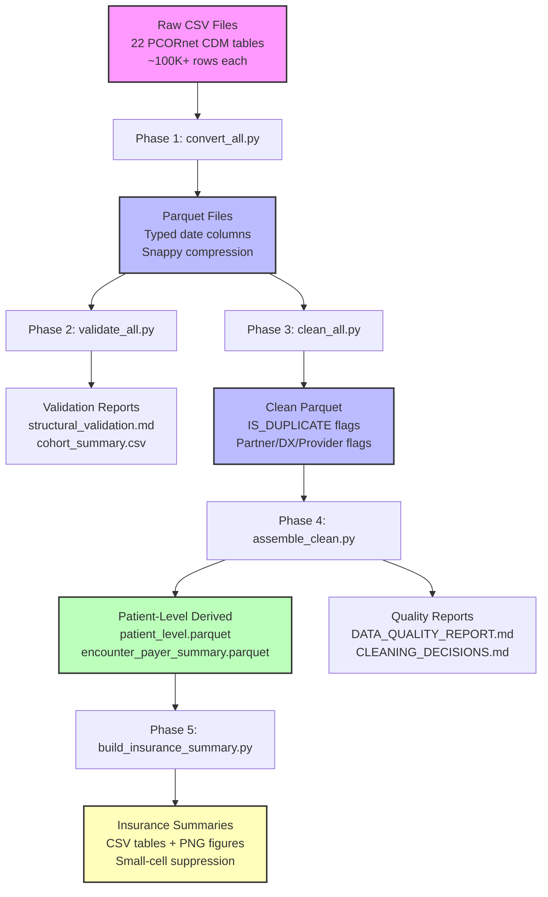

# HL Data Pipeline: Architecture & Data Flow

**Project:** HL insurance inequities pipeline
**Study:** UFPTI 2405-HLX17A
**Last Updated:** 2026-03-17

---

## Overview

This pipeline transforms OneFlorida+ PCORnet CDM (Common Data Model) data for a Hodgkin Lymphoma (HL) cohort study investigating insurance disparities and treatment outcomes. The pipeline processes 22 clinical tables (~100K+ rows each) through five sequential phases: CSV-to-Parquet conversion, structural validation, deduplication and harmonization, patient-level aggregation, and insurance/payer analysis.

**What it produces:**
- **Patient-level derived dataset** (`derived/patient_level.parquet`): One row per patient with demographics, HL subtype, treatment flags, and payer summaries
- **Quality reports** (`reports/DATA_QUALITY_REPORT.md`, `CLEANING_DECISIONS.md`): Data quality metrics (Kahn Framework) and cleaning decisions
- **Insurance summaries** (`reports/insurance_summary.md`, CSV tables, PNG figures): Payer category distributions, dual-eligible analysis, treatment-stratified insurance cross-tabs

**Core constraint:** Data correctness above all else. If the output data is wrong, nothing else matters. All design decisions prioritize correctness and verifiability over performance or convenience.

---

## Pipeline Architecture



**Approximate data volumes at each stage:**
- Raw CSV: ~100K-500K rows per table, 22 tables, ~5-10 GB total
- Parquet: ~80-90% size reduction via snappy compression
- Clean Parquet: Same row counts + flag columns (IS_DUPLICATE, FLAG_HL_DX, etc.)
- Patient-Level Derived: ~5K-10K patients (cohort size), 50+ variables per patient
- Reports: Small-cell suppressed (counts 1-10 → "-" in CSV/MD outputs)

---

## Prerequisites

### Environment
- **Python:** 3.11+ (uses `tomllib` from stdlib)
- **Dependencies:** Polars (data processing), ruff (linting), pytest (testing)
- **Package manager:** conda/mamba (see `environment.yml`)
- **Execution environment:** HPC interactive sessions (`srun --pty bash`) or local workstation

### Configuration
- **`config/paths.toml`:** Required configuration file with path declarations
  - `data_root`: Root directory for raw CSV files (OneFlorida+ extract location)
  - `scratch_root`: Scratch directory for intermediate Parquet files
  - `parquet_dir`: Output directory for typed Parquet files (Phase 1)
  - `derived_dir`: Output directory for patient-level derived data (Phase 4)
  - `reports_dir`: Output directory for reports (Phases 2-5)
- **Path resolution:** All paths resolved relative to project root (directory containing `config/`)

### Input Data
- **22 PCORnet CDM tables as CSV:** DEMOGRAPHIC, ENROLLMENT, ENCOUNTER, DIAGNOSIS, PROCEDURES, VITAL, LAB_RESULT_CM, PRESCRIBING, DEATH, TUMOR_REGISTRY, PROVIDER, LDS_ADDRESS_HISTORY, etc.
- **`datastructure.txt`:** Manifest file listing 22 table filenames (OneFlorida+ extract metadata)
  - Format: One filename per line (e.g., `DIAGNOSIS_Mailhot_V1.csv`)
  - Special handling: `LAB_RESULT_Mailhot_V1.csv` aliased to `LAB_RESULT_CM` (PCORnet standard name)
- **Reference data:**
  - `Outcomes.csv`: Treatment modality code lookup (SCT CPTs, chemo J-codes, radiation CPTs, surveillance tests)
  - `STAGE_ajcc_column_values2.csv`: AJCC staging reference data for tumor registry validation
  - `valuesets.csv`: PCORnet value set reference for code validation

---

## Phase 1: CSV-to-Parquet Conversion

**Script:** `scripts/convert_all.py`
**Module:** `src/load/`

### Summary

Phase 1 converts 22 OneFlorida+ PCORnet CDM CSV files to typed Parquet format with automatic date column detection. Raw CSVs (all String columns) are transformed to Parquet with date columns typed as Date and remaining columns as String. Date detection uses a 4-format fallback chain (DATETIME → DATE9 → YYYYMMDD → MM/DD/YYYY) with 30%/50% match thresholds for auto-detection. Output includes Parquet files with snappy compression and a file_inventory.csv metadata file.

**Clinical context:** OneFlorida+ extracts use SAS DATE9. format (e.g., 01JAN2020) for most date columns, but some partners use DATETIME (01JAN2020:00:00:00) or YYYYMMDD (20200101). Mixed-format columns within a single table are possible and handled via fallback logic.

### Data Transformations

**Schema changes:**
- Input: All-String CSV (SAS default export format)
- Output: Typed Parquet with date columns as Date, remaining as String
- Date columns detected: BIRTH_DATE, DX_DATE, ADMIT_DATE, DISCHARGE_DATE, MEASURE_DATE, SPECIMEN_DATE, RX_ORDER_DATE, ENR_START_DATE, ENR_END_DATE, DEATH_DATE, DATE_OF_DIAGNOSIS, DT_CHEMO, DT_RAD, and any column matching `*_DATE` or `*_DT` pattern with ≥30% value match

**Row counts:** Unchanged (no filtering or deduplication at this stage)

**Files produced:**
- 22 Parquet files in `parquet_dir/` (e.g., `DIAGNOSIS.parquet`, `ENCOUNTER.parquet`)
- `file_inventory.csv`: Per-table metadata with row count, CSV size, Parquet size, date columns found/converted, elapsed time

**Performance:** ~5-10 minutes for full dataset on HPC; sequential processing (one table at a time); mtime check skips unchanged tables

<details>
<summary>Date detection heuristic detail</summary>

**4-format fallback chain:**

1. **DATETIME_RE:** `r"\d{2}[A-Z]{3}\d{4}:\d{2}:\d{2}:\d{2}"` (e.g., `01JAN2020:14:30:00`)
2. **DATE9_RE:** `r"\d{2}[A-Z]{3}\d{4}"` (e.g., `01JAN2020`)
3. **YYYYMMDD_RE:** `r"\d{8}"` (e.g., `20200101`)
4. **MM/DD/YYYY:** Polars native parser (e.g., `01/15/2020`)

**Thresholds:**
- Name heuristic: ≥30% match + column name contains `DATE`, `DT`, `BIRTH`, `ADMIT`, `DISCHARGE`, etc.
- Value-only heuristic: ≥50% match (no name requirement)

**Known columns:** Predefined set of expected date columns (BIRTH_DATE, DX_DATE, etc.) are always attempted regardless of heuristic

**Edge cases:**
- Mixed-format columns: If multiple formats present, first format with ≥30% match wins
- Parse failures: If all formats fail, column remains String dtype (no warning printed; see AUDIT-002)
- Null handling: Null values excluded from match percentage calculation

**Documented issues:**
- AUDIT-002 (HIGH): Thresholds (30%/50%) not empirically validated against actual OneFlorida+ data
- AUDIT-009 (MEDIUM): Parse failure rate not reported; >10% failures go unnoticed

</details>

<details>
<summary>Per-table date columns detected</summary>

**Typical date columns by table:**
- DEMOGRAPHIC: BIRTH_DATE
- ENROLLMENT: ENR_START_DATE, ENR_END_DATE
- ENCOUNTER: ADMIT_DATE, DISCHARGE_DATE
- DIAGNOSIS: DX_DATE, ADMIT_DATE
- PROCEDURES: PX_DATE, ADMIT_DATE
- VITAL: MEASURE_DATE
- LAB_RESULT_CM: SPECIMEN_DATE, RESULT_DATE
- PRESCRIBING: RX_ORDER_DATE, RX_START_DATE, RX_END_DATE
- DEATH: DEATH_DATE
- TUMOR_REGISTRY: DATE_OF_DIAGNOSIS, DT_CHEMO, CHEMO_START_DATE_SUMMARY, DT_RAD, RAD_START_DATE_SUMMARY
- PROVIDER: (no date columns)
- LDS_ADDRESS_HISTORY: ADDRESS_PERIOD_START, ADDRESS_PERIOD_END

Actual columns detected may vary by partner/extract; file_inventory.csv contains exact columns per run.

</details>

<details>
<summary>file_inventory.csv schema</summary>

**Columns:**
- `table_name`: PCORnet table name (resolved via `resolve_table_name()`)
- `row_count`: Number of rows in Parquet file
- `csv_size_mb`: Original CSV file size in MB
- `parquet_size_mb`: Output Parquet file size in MB
- `compression_ratio`: CSV size / Parquet size
- `date_columns_found`: Comma-separated list of date columns detected
- `date_columns_converted`: Comma-separated list of date columns successfully typed as Date
- `elapsed_seconds`: Time to convert this table

</details>

---

## Phase 2: Structural Validation

**Script:** `scripts/validate_all.py`
**Module:** `src/validate/`

### Summary

Phase 2 performs read-only structural validation of the typed Parquet files. Validation includes: schema comparison against DatasetCoverPage (expected columns per PCORnet CDM version), PATID/ENCOUNTERID referential integrity checks (no orphaned events), per-partner completeness profiling, HL cohort verification (149 ICD codes with dual-date methods), and enrollment cross-checks. All validation results are written to reports; no data modification occurs at this stage.

**Clinical context:** PCORnet CDM enforces referential integrity (all events must link to DEMOGRAPHIC via PATID; encounter-based events link via ENCOUNTERID). HL cohort membership requires 2+ encounters with HL diagnosis on distinct dates OR 2+ HL diagnoses on distinct dates (dual-date methods to exclude rule-out diagnoses).

### Data Transformations

**Data modification:** None (read-only validation stage)

**Outputs produced:**
- `reports/structural_validation.md`: Schema validation results, key integrity summary, completeness heatmap (per-partner per-table)
- `reports/completeness_by_partner.csv`: Detailed completeness metrics (row counts, null rates per partner per table)
- `reports/cohort_summary.csv`: HL cohort patient-level summary (2 date methods, ICD version, enrollment status)

**Small-cell suppression:** All count tables in reports use `flag_small_cell()` — counts 1-10 displayed with "⚠" warning but value visible (internal review). Published CSVs use `_suppress()` — counts 1-10 replaced with "-" (HIPAA Safe Harbor compliance).

<details>
<summary>Validation checks detail</summary>

**Schema validation (`validate_table_schema`):**
- Compares actual Parquet columns against expected columns from DatasetCoverPage
- Reports missing columns (expected but absent) and extra columns (present but not expected)
- No enforcement (soft validation); pipeline proceeds even with mismatches

**Key integrity checks:**
- `check_patid_integrity()`: Verifies all PATID values in event tables exist in DEMOGRAPHIC.PATID
- `check_encounterid_integrity()`: Verifies all ENCOUNTERID values in encounter-based tables exist in ENCOUNTER.ENCOUNTERID
- `check_patid_uniqueness()`: Verifies DEMOGRAPHIC.PATID is unique (one row per patient)
- Reports orphaned records (events with non-existent PATID/ENCOUNTERID) but does not delete them

**Completeness profiling:**
- Per-partner per-table row counts and null rates for key columns (PATID, ENCOUNTERID, DX_DATE, etc.)
- Small-cell flagging: row counts 1-10 flagged with "⚠" in markdown tables
- Heatmap symbol logic: ✓ (complete), ○ (partial), − (missing), ⚠ (small cell)

**HL cohort verification (`verify_hl_cohort`):**
- Code set: 149 ICD codes (77 ICD-10 C81.xx + 72 ICD-9 201.xx, excluding C81.5x/C81.6x/201.3x)
- Dual format support: Dotted (C81.10) and normalized (C8110) — both formats accepted
- Dual-date methods:
  - Method A: 2+ distinct DX_DATE values for HL codes
  - Method B: 2+ distinct ADMIT_DATE values from encounters linked to HL diagnoses
- ICD version detection: Checks if patient has ICD-9 only, ICD-10 only, or both
- DX_TYPE validation: Checks if HL diagnoses have valid DX_TYPE (AD, DI, FI, etc.)

**Enrollment cross-check (`enrollment_crosscheck`):**
- Verifies HL patients have at least one ENROLLMENT record
- Reports patients with HL diagnosis but no enrollment (data quality issue)

**Small-cell flagging logic:**
- Threshold: `SMALL_CELL_THRESHOLD = 10` (configurable constant)
- Markdown reports: `flag_small_cell(count)` → "N ⚠" for 1 ≤ N ≤ 10
- CSV reports: `_suppress(count)` → "-" for 1 ≤ N ≤ 10
- Rationale: HIPAA Safe Harbor requires suppressing counts 1-10 to prevent re-identification

</details>

<details>
<summary>Cohort code set (149 codes)</summary>

**ICD-10-CM (77 codes):**
- C81.00 through C81.9A (all codes in C81.xx range)
- Exclusions: C81.5x (nodular lymphocyte-depleted), C81.6x (other types)
- Rationale: Exclusions are non-classical HL subtypes not included in study protocol

**ICD-9-CM (72 codes):**
- 201.00 through 201.98 (all codes in 201.xx range)
- Exclusions: 201.3x (lymphocytic-histiocytic predominance)
- Rationale: Exclusion aligns with ICD-10 C81.5x/C81.6x exclusion (similar histology)

**Dual format handling:**
- Dotted: C81.10, 201.00 (some partners)
- Normalized: C8110, 20100 (other partners)
- Detection: `detect_dx_format()` checks first non-null DX value for dot presence
- Normalization: `normalize_icd_code()` strips dots for set membership check

**Code set source:** `src/validate/cohort.py` constants `ICD10_HL_CODES`, `ICD9_HL_CODES`, `ALL_HL_CODES`

</details>

---

## Phase 3: Deduplication & Harmonization

**Script:** `scripts/clean_all.py`
**Modules:** `src/clean/dedup.py`, `src/clean/harmonize.py`, `src/clean/flags_diagnosis_provider.py`

### Summary

Phase 3 adds flag columns to identify duplicates, cross-table consistency issues, partner provenance, and clinical flags (HL diagnosis, survivorship, oncology provider). No records are deleted; all changes are additive flag columns (0/1 Int8). Composite-key deduplication identifies exact duplicates per table (e.g., DIAGNOSIS: ID+DX_DATE+DX). Cross-table consistency checks flag events outside encounter date bounds, encounters outside enrollment periods, and demographic inconsistencies. Partner provenance flags identify retrospectively mapped ICD codes (AMS, UMI), claims-only data (FLM), and death registry records (VRT). Diagnosis flags identify HL cohort members and survivorship codes; provider flags identify oncology specialists.

**Clinical context:** Duplicate records (same patient, same diagnosis, same date) occur due to data quality issues or multiple reporting partners. Flagging enables downstream analysis to handle duplicates appropriately (e.g., count unique diagnoses, not repeated records). Cross-table consistency flags identify data quality issues (events recorded outside encounter dates, encounters outside enrollment periods) without deleting records (preserves data for audit).

### Data Transformations

**Columns added:**
- `IS_DUPLICATE` (Int8): 0/1 flag for exact-match duplicates per composite key
- Partner provenance flags (Int8): `ICD_MAPPED`, `CLAIMS_ONLY`, `DEATH_ONLY`
- Consistency flags (Int8): `_con_outside_encounter`, `_con_outside_enrollment`, `_con_no_enrollment`, `_con_demo_inconsistent`, `_con_death_inconsistent`
- Diagnosis flags (Int8): `FLAG_HL_DX`, `FLAG_SURVIVORSHIP_DX` (DIAGNOSIS table)
- Provider flags (Int8): `FLAG_CANCER_PROVIDER` (PROVIDER table)

**Row counts:** Unchanged (no deletions; flagging only)

**Output:** Flagged Parquet files written to intermediate scratch location (later copied to `parquet_clean/` in Phase 4)

**Reports produced:** `reports/dedup_report.md` with per-table duplicate counts (small-cell suppressed)

<details>
<summary>Dedup keys and flag columns per table</summary>

**DEDUP_KEYS (composite keys per table):**

```python
DEDUP_KEYS = {
    "DIAGNOSIS": ["PATID", "DX_DATE", "DX"],
    "PROCEDURES": ["PATID", "PX_DATE", "PX"],
    "LAB_RESULT_CM": ["PATID", "LAB_LOINC", "SPECIMEN_DATE", "RESULT_NUM"],
    "VITAL": ["PATID", "MEASURE_DATE"],  # Note: Missing vital type (see AUDIT-010)
    "PRESCRIBING": ["PATID", "RX_ORDER_DATE", "RXNORM_CUI"],
    "ENCOUNTER": ["PATID", "ENCOUNTERID", "ADMIT_DATE"],
    "DEATH": ["PATID", "DEATH_DATE"],
    "TUMOR_REGISTRY": ["PATID", "DATE_OF_DIAGNOSIS"],
}
```

**Rationale per key:**
- DIAGNOSIS: Same patient + same diagnosis + same date → exact duplicate
- PROCEDURES: Same patient + same procedure + same date → exact duplicate
- LAB_RESULT_CM: Same patient + same LOINC + same specimen date + same numeric result → exact duplicate
- VITAL: Same patient + same measurement date → potential duplicate (WARNING: missing vital type; see AUDIT-010)
- PRESCRIBING: Same patient + same drug (RXNORM) + same order date → exact duplicate
- ENCOUNTER: Same patient + same encounter ID + same admit date → exact duplicate
- DEATH: Same patient + same death date → exact duplicate
- TUMOR_REGISTRY: Same patient + same diagnosis date → exact duplicate

**Null key behavior:** Polars `is_duplicated()` treats null != null (correct behavior for unknowns); rows with null keys NOT flagged as duplicates

**Flag behavior:** ALL occurrences of a duplicate key are flagged (not just subsequent rows); use IS_DUPLICATE=0 to select non-duplicates OR count unique via group_by

</details>

<details>
<summary>Consistency check descriptions</summary>

**Cross-table consistency flags:**

**`_con_outside_encounter` (event tables):**
- Tables: DIAGNOSIS, PROCEDURES, LAB_RESULT_CM, VITAL, PRESCRIBING
- Logic: Event date (DX_DATE, PX_DATE, etc.) not within any encounter [ADMIT_DATE - 1, DISCHARGE_DATE + 1]
- Rationale: PCORnet events should link to encounters; events outside encounter dates indicate data quality issues
- ±1 day buffer: Accommodates date-only precision (event time may be 23:59 on ADMIT_DATE - 1)

**`_con_outside_enrollment` (ENCOUNTER table):**
- Logic: ADMIT_DATE not covered by any ENROLLMENT [ENR_START_DATE, ENR_END_DATE]
- Rationale: Patients should have enrollment records for encounter dates; missing enrollment indicates data quality issues

**`_con_no_enrollment` (ENCOUNTER table):**
- Logic: Patient has no ENROLLMENT records
- Rationale: All patients should have enrollment records; missing enrollment indicates incomplete data

**`_con_demo_inconsistent` (event tables):**
- Logic: Birth date or gender inconsistent across records for same patient
- Rationale: Demographic data should be consistent; inconsistencies indicate data quality issues

**`_con_death_inconsistent` (DEATH table):**
- Logic: Death date inconsistent with death flags in other tables
- Rationale: Death records should align with death indicators in DEMOGRAPHIC/ENCOUNTER

</details>

---

## Phase 4: Assembly & Derived

**Script:** `scripts/assemble_clean.py`
**Module:** `src/report/quality_report.py`

### Summary

Phase 4 copies flagged Parquet files to `parquet_clean/` (final cleaned dataset), builds patient-level derived variables (one row per patient), and writes quality reports. Patient-level aggregation combines data from multiple tables: demographics (first record from DEMOGRAPHIC), HL subtype (4th character of C81.xx ICD-10 code), treatment flags (SCT, chemo, radiation from PROCEDURES/PRESCRIBING/TUMOR_REGISTRY), and payer summaries (effective payer logic, dual-eligible detection). Quality reports use Kahn Framework metrics (completeness, conformance, plausibility, persistence) and document all cleaning decisions.

**Clinical context:** Patient-level derived variables enable cohort analysis (one row per patient vs. many events per patient). HL subtype classification (nodular sclerosis most common, lymphocyte-rich second most common) affects treatment and prognosis. Treatment flags (HAD_CHEMO, HAD_RADIATION, HAD_SCT) enable treatment-stratified insurance analyses.

### Data Transformations

**Aggregation:** Encounter-level → patient-level (many rows per patient → one row per patient)

**Patient-level variables created:**
- Demographics: PATID, BIRTH_DATE, SEX, RACE, ETHNICITY (first record from DEMOGRAPHIC)
- Age: AGE_AT_HL_DX (calculated from BIRTH_DATE and FIRST_HL_DX_DATE), AGE_BAND (<21, 21-39, 40-64, 65+)
- HL diagnosis: FIRST_HL_DX_DATE (earliest DX_DATE for HL codes), HL_SUBTYPE (from ICD-10 4th character)
- Treatment: HAD_CHEMO, HAD_RADIATION, HAD_SCT (0/1 flags from PROCEDURES/PRESCRIBING/TUMOR_REGISTRY)
- Payer: PAYER_AT_DX (payer category at first HL diagnosis), INSURANCE_CONTINUITY (enrollment coverage flag)
- Geography: REGION (Southeast states vs. Other from LDS_ADDRESS_HISTORY)

**Outputs:**
- `derived/patient_level.parquet`: Patient-level derived dataset (one row per HL patient)
- `derived/encounter_payer_summary.parquet`: Patient-level payer summary (one row per patient with encounters + enrollment)
- `reports/DATA_QUALITY_REPORT.md`: Comprehensive quality metrics per Kahn Framework
- `reports/CLEANING_DECISIONS.md`: Documentation of all cleaning/transformation decisions

<details>
<summary>Patient-level variable definitions</summary>

**Demographics:**
- `PATID`: Patient ID (from DEMOGRAPHIC)
- `BIRTH_DATE`: Birth date (from DEMOGRAPHIC); null if masked (01JAN1900)
- `SEX`: Sex (M/F/A/NI/UN/OT from DEMOGRAPHIC)
- `RACE`: Race (5-category PCORnet race from DEMOGRAPHIC)
- `ETHNICITY`: Ethnicity (Hispanic/Not Hispanic/NI/UN/OT from DEMOGRAPHIC)

**Age:**
- `AGE_AT_HL_DX`: Age at first HL diagnosis in years (calculated as [FIRST_HL_DX_DATE - BIRTH_DATE] / 365.25); null if BIRTH_DATE is masked
- `AGE_BAND`: Age category (<21, 21-39, 40-64, 65+); masked ages → 65+

**HL diagnosis:**
- `FIRST_HL_DX_DATE`: Earliest DX_DATE for HL codes (from DIAGNOSIS with FLAG_HL_DX=1)
- `FIRST_HL_DX_CODE`: ICD code from first HL diagnosis
- `HL_SUBTYPE`: HL histologic subtype from ICD-10 C81.x 4th character:
  - C81.0x → Nodular lymphocyte predominant
  - C81.1x → Nodular sclerosis
  - C81.2x → Mixed cellularity
  - C81.3x → Lymphocyte depleted
  - C81.4x → Lymphocyte-rich
  - C81.7x → Other
  - C81.9x → Unspecified
  - ICD-9 codes → "ICD-9 (no subtype)"

**Treatment:**
- `HAD_CHEMO`: 1 if patient has chemo dates (TUMOR_REGISTRY DT_CHEMO/CHEMO_START_DATE_SUMMARY or PRESCRIBING RX_ORDER_DATE with chemo J-codes); 0 otherwise
- `HAD_RADIATION`: 1 if patient has radiation dates (TUMOR_REGISTRY DT_RAD/RAD_START_DATE_SUMMARY or PROCEDURES with radiation CPTs 774xx); 0 otherwise
- `HAD_SCT`: 1 if patient has SCT procedure dates (PROCEDURES with SCT CPTs 38240, 38241, 38242); 0 otherwise
- `FIRST_HL_TX_DATE`: Earliest treatment date (chemo, radiation, or SCT)
- `DX_TO_TX_DAYS`: Days from FIRST_HL_DX_DATE to FIRST_HL_TX_DATE; null if no treatment

**Payer (see Phase 5 for full payer logic):**
- `PAYER_AT_DX`: Payer category at first HL diagnosis (mode of valid payer in ±30 day window)
- `INSURANCE_CONTINUITY`: 1 if enrollment covers [FIRST_HL_DX_DATE, last encounter ADMIT_DATE]; 0 otherwise

**Geography:**
- `REGION`: "Southeast" if LDS_ADDRESS_HISTORY.ADDRESS_STATE in {AL, AR, FL, GA, KY, LA, MS, NC, SC, TN, VA, WV}; "Other" otherwise

</details>

---

## Phase 5: Insurance/Payer Analysis

**Script:** `scripts/build_insurance_summary.py`
**Module:** `src/report/encounter_payer_summary.py`

### Summary

Phase 5 builds insurance/payer analysis tables and figures from `derived/encounter_payer_summary.parquet` (produced in Phase 4). Payer categories are derived from PCORnet PAYER_TYPE_PRIMARY/SECONDARY codes with effective payer logic (primary → secondary fallback for sentinel values), dual-eligible detection (Medicare+Medicaid or codes 14/141/142), and treatment window payer assignment (30-day windows around first/last treatment dates). Outputs include payer category distribution tables, payer-at-treatment cross-tabs (first DX, first/last chemo, first/last radiation, first/last SCT), dual-eligible transition analysis, and bar chart figures. All outputs use small-cell suppression (counts 1-10 → "-" in CSV/MD, excluded from figures).

**Clinical context:** Insurance status affects access to care, treatment decisions, and outcomes. Dual-eligible patients (Medicare + Medicaid) have complex insurance status affecting cost-sharing and provider networks. Payer changes during treatment (e.g., Medicare → Medicaid transition) indicate financial distress or eligibility changes. Treatment-specific payer analysis (payer at first chemo, payer at first radiation) enables investigation of insurance barriers to specific treatments.

### Data Transformations

**Input:** `derived/encounter_payer_summary.parquet` (one row per patient with encounters + enrollment)

**Outputs:**
- `reports/insurance_summary.md`: Narrative summary with payer category distribution tables
- `reports/encounter_payer_summary.csv`: All encounter-payer summary variables with counts/percentages
- `reports/payer_at_first_dx.csv`: Payer category distribution at first HL diagnosis
- `reports/payer_at_first_chemo.csv`: Payer category distribution at first chemotherapy
- `reports/payer_at_last_chemo.csv`: Payer category distribution at last chemotherapy
- `reports/payer_at_first_radiation.csv`: Payer category distribution at first radiation
- `reports/payer_at_last_radiation.csv`: Payer category distribution at last radiation
- `reports/payer_at_first_sct.csv`: Payer category distribution at first SCT
- `reports/payer_at_last_sct.csv`: Payer category distribution at last SCT
- `reports/payer_crosstab_*.csv`: Payer transition matrices (e.g., payer at first DX → payer at first chemo)
- `reports/figures/insurance_payer_at_first_dx.png`: Bar chart of payer category distribution at first DX
- `reports/figures/insurance_payer_at_first_chemo.png`: Bar chart of payer category distribution at first chemo

**Small-cell suppression:** Counts 1-10 → "-" in CSV/MD tables; small-cell values excluded from bar charts (no bars rendered for counts 1-10)

<details>
<summary>Payer logic detail</summary>

**Effective payer derivation (per encounter):**

1. Check if `PAYER_TYPE_PRIMARY` is valid (non-null, non-empty, not sentinel)
   - Sentinel values: null, empty string, "NI", "UN", "OT"
   - Optional sentinel: "99", "9999" (if `INCLUDE_99_AS_SENTINEL = True`; default False)
2. If primary valid → use primary as effective payer
3. If primary sentinel → check if `PAYER_TYPE_SECONDARY` exists and is valid
4. If secondary valid → use secondary as effective payer
5. If both primary and secondary invalid → effective payer = null

**Valid payer:** Non-null, non-empty, not in sentinel set

**Encounters without valid payer:** Excluded from payer category logic (e.g., if patient has 5 encounters but only 3 have valid payer, only 3 contribute to payer category counts)

**When PAYER_TYPE_SECONDARY is missing:** Effective payer = primary only (with same valid check); encounter-level dual-eligible cannot be computed (patient-level DUAL_ELIGIBLE = 0)

**Dual-eligible detection (per encounter):**

Encounter-level dual-eligible = 1 when ANY of:
- (a) Primary is Medicare (prefix 1) AND secondary is Medicaid (prefix 2)
- (b) Primary is Medicaid (prefix 2) AND secondary is Medicare (prefix 1)
- (c) Primary OR secondary is one of explicit dual-eligibility codes: 14, 141, 142 (PCORnet: Dual Eligibility Medicare/Medicaid Organization, D-SNP, FIDE-SNP)

Otherwise encounter-level dual-eligible = 0.

**Patient-level DUAL_ELIGIBLE:** 1 if patient has at least one encounter with encounter-level dual-eligible = 1; 0 otherwise

**30-day treatment window logic:**

For each treatment type (chemo, radiation, SCT):
1. Find all encounters with ADMIT_DATE within ±30 days of treatment date
2. Filter to encounters with valid effective payer (non-null, non-sentinel)
3. Take mode (most frequent) payer category among valid encounters in window
4. If no encounters in window OR no valid payer in window → payer at treatment = null

**Window rationale:** 30 days is arbitrary (no clinical standard); chosen pragmatically to capture payer around treatment without excessive window width. See AUDIT-017 for sensitivity analysis recommendation.

**Category mapping (PCORnet codes → reporting categories):**

When encounter is dual-eligible → category = "Dual eligible"
Otherwise, map by prefix:
- 1x → Medicare
- 2x → Medicaid
- 5x, 6x → Private
- 3x, 4x → Other government (includes 41 = Corrections Federal)
- 8x → No payment / Self-pay
- 7x, 9x (excluding 99/9999) → Other
- 99, 9999 → Unavailable (if `INCLUDE_99_AS_SENTINEL = False`; default)
- NI, UN, OT, empty, "UNKNOWN" → Unknown

**Category levels:** Medicare, Medicaid, Dual eligible, Private, Other government, No payment / Self-pay, Other, Unavailable, Unknown

</details>

<details>
<summary>Treatment-cohort cross-tabs</summary>

**Treatment-cohort-specific tables:**

For each treatment type (chemo, radiation, SCT), build payer summary tables restricted to patients with that treatment:

**Example: Chemo cohort (HAD_CHEMO = 1)**
- `reports/payer_at_first_chemo.csv`: Payer category distribution at first chemo (N, %) among chemo cohort only
- `reports/payer_at_last_chemo.csv`: Payer category distribution at last chemo (N, %) among chemo cohort only
- `reports/payer_crosstab_first_dx_to_first_chemo.csv`: Payer transition matrix (rows = payer at first DX, columns = payer at first chemo) among chemo cohort only

**Rationale:** Treatment-specific payer analysis isolates insurance barriers to specific treatments (e.g., if Medicaid patients have lower chemo rates, payer at first chemo may show disproportionately low Medicaid counts)

**Small-cell handling:** Row/column totals <10 → "-" in CSV tables; entire row/column suppressed if sum <10

</details>

---

## Cross-Cutting Concerns

### Small-Cell Suppression (HIPAA Safe Harbor)

**Threshold:** Counts 1-10 suppressed to prevent re-identification (HIPAA Safe Harbor §164.514(b)(2))

**Implementation:**
- Markdown reports (internal review): `flag_small_cell(count)` → "N ⚠" for 1 ≤ N ≤ 10 (value visible with warning)
- CSV reports (external sharing): `_suppress(count)` → "-" for 1 ≤ N ≤ 10 (value replaced)
- Bar chart figures: Small-cell values excluded (no bars rendered for counts 1-10)

**Applied to:** All published reports (CSV, markdown, figures) in Phases 2-5

**Not applied to:** Parquet files (retain actual counts for re-analysis; Parquet files are intermediate artifacts not published)

**Rationale:** Markdown reports with warnings help debugging and internal review; CSV reports with suppression protect PHI for external sharing

**Configuration:** `SMALL_CELL_THRESHOLD = 10` constant in `src/validate/structural.py`

### Configuration

**`config/paths.toml`:** Single source of truth for all paths

```toml
data_root = "/path/to/oneflorida/extract"
scratch_root = "/path/to/scratch"
parquet_dir = "/path/to/parquet"
derived_dir = "/path/to/derived"
reports_dir = "/path/to/reports"
```

**Path resolution:** All paths resolved relative to project root (directory containing `config/` directory)

**`datastructure.txt`:** OneFlorida+ extract manifest file listing 22 table filenames

- Format: One filename per line (e.g., `DIAGNOSIS_Mailhot_V1.csv`)
- Special handling: `LAB_RESULT_Mailhot_V1.csv` aliased to `LAB_RESULT_CM` (PCORnet standard name)
- Used by: `parse_datastructure()` in `src/load/schema.py`

**`Outcomes.csv`:** Treatment modality code lookup

- Columns: Modality, Code system, Code
- Modalities: SCT (stem cell transplant), CHEMO (chemotherapy), RADIATION, MAMMO (mammography), BREAST_MRI, ECHO (echocardiogram), STRESS (stress test), ECG (electrocardiogram), MUGA, PFT (pulmonary function test), TSH, CBC
- Code systems: CPT, ICD-10-PCS, LOINC
- Used by: `load_outcomes_code_lookup()` in `src/clean/outcomes_flags.py`

### HL Cohort Definition

**149 ICD codes:** 77 ICD-10 (C81.xx) + 72 ICD-9 (201.xx)

**ICD-10-CM:** C81.00 through C81.9A, excluding C81.5x (nodular lymphocyte-depleted) and C81.6x (other types)

**ICD-9-CM:** 201.00 through 201.98, excluding 201.3x (lymphocytic-histiocytic predominance)

**Dual-format support:**
- Dotted: C81.10, 201.00 (some partners use dot notation)
- Normalized: C8110, 20100 (other partners strip dots)
- Detection: `detect_dx_format()` checks first non-null DX value for dot presence
- Normalization: `normalize_icd_code()` strips dots for set membership check

**Cohort membership:** Patient included if has 2+ encounters with HL diagnosis on distinct dates OR 2+ HL diagnoses on distinct dates (dual-date methods to exclude rule-out diagnoses)

**Code set source:** `src/validate/cohort.py` constants `ICD10_HL_CODES`, `ICD9_HL_CODES`, `ALL_HL_CODES`

**Clinical context:** HL (Hodgkin lymphoma) is a rare cancer (~8,000 cases/year in US); PCORnet CDM captures HL diagnoses via ICD codes in DIAGNOSIS table. Exclusions (C81.5x, C81.6x, 201.3x) are non-classical HL subtypes not included in study protocol.

---

## Known Issues

This section summarizes HIGH and MEDIUM severity audit items from [`docs/AUDIT_LOG.md`](AUDIT_LOG.md). See AUDIT_LOG.md for full details, code context, and recommended actions.

### HIGH Severity (Data Correctness Impact)

**AUDIT-001: Sentinel value 99/9999 in payer fields not consistently handled**
- Location: `src/report/encounter_payer_summary.py:58`
- Issue: `INCLUDE_99_AS_SENTINEL` flag exists but defaults to False; unclear if 99/9999 should trigger fallback to secondary payer or map to "Unavailable" category
- Impact: If 99/9999 should trigger fallback, currently missing opportunity to use secondary payer data, potentially misclassifying insurance status
- Recommended action: Validate with domain expert; document decision

**AUDIT-002: Date parsing 30%/50% match thresholds for auto-detection**
- Location: `src/load/convert.py:90-100`
- Issue: Thresholds (30% name+value, 50% value-only) not empirically validated against actual OneFlorida+ data
- Impact: May miss date columns (false negative <30%) or false-positive on numeric codes that happen to match date patterns
- Recommended action: Sample 10 tables, manually verify all date columns detected correctly

**AUDIT-003: LAB_RESULT vs LAB_RESULT_CM table name mismatch**
- Location: `src/load/schema.py:29`, `src/clean/dedup.py:27`
- Issue: Schema and code refer to LAB_RESULT_CM (PCORnet standard) but actual CSV may be named LAB_RESULT; silent skip if mismatch
- Impact: Pipeline may silently skip LAB_RESULT data if CSV naming doesn't match schema; dedup misses LAB records
- Recommended action: Query HPC for actual filename; add alias mapping if needed

**AUDIT-004: Null key behavior in deduplication**
- Location: `src/clean/dedup.py:81-97`
- Issue: Dedup logic uses Polars `is_duplicated()` with null != null behavior; not explicitly tested
- Impact: If Polars behavior changes to treat nulls as equal, dedup logic would incorrectly flag non-duplicates
- Recommended action: Add unit test confirming null keys don't match

**AUDIT-005: Dual-eligible detection incomplete when secondary payer absent**
- Location: `src/report/encounter_payer_summary.py:385`
- Issue: Dual-eligible = 0 when PAYER_TYPE_SECONDARY is null, even if primary is 14/141/142 (explicit dual-eligible codes)
- Impact: May undercount dual-eligible prevalence if secondary payer data is sparse
- Recommended action: Check secondary payer completeness rates; update logic to check primary alone if secondary missing

### MEDIUM Severity (Usability/Maintenance Impact)

**AUDIT-006: Pandas dependency in outcomes_flags.py (Polars codebase)**
- Location: `src/clean/outcomes_flags.py:34`
- Issue: Uses pandas for CSV parsing in otherwise Polars-first codebase
- Impact: Adds dependency bloat, maintenance burden (two CSV parsers), inconsistency
- Recommended action: Replace `pd.read_csv()` with `pl.read_csv()`; remove pandas dependency

**AUDIT-007: Small-cell suppression inconsistency (flag vs suppress)**
- Location: `scripts/build_insurance_summary.py:269`, `scripts/clean_all.py:110`
- Issue: Markdown reports use `flag_small_cell()` (adds warning but value visible); CSV reports use `_suppress()` (replaces with dash)
- Impact: Inconsistent UX (users see flagged values in markdown, suppressed in CSV)
- Rationale: Intentional design (markdown for internal review, CSV for external sharing)
- Recommended action: Document in CLEANING_DECISIONS.md; centralize suppression logic

**AUDIT-008: src/clean/validate/ near-duplication of src/validate/**
- Location: `src/clean/validate/__init__.py:19`
- Issue: Entire `src/clean/validate/` directory is near-duplicate of `src/validate/`; unclear which is authoritative
- Impact: Maintenance burden doubles; bug fixes may only apply to one copy; divergence risk
- Recommended action: Audit differences; consolidate or document divergence rationale

**AUDIT-009: Date parsing fallback: no parse failure rate reporting**
- Location: `src/load/convert.py:81-150`
- Issue: 4-format fallback silently keeps unparsed dates as strings; no warning if >10% fail
- Impact: Parse failures go unnoticed; dates treated as strings break temporal logic
- Recommended action: Add parse failure threshold check; log warning if >10% fail

**AUDIT-010: VITAL dedup key uses only MEASURE_DATE without vital type**
- Location: `src/clean/dedup.py:43`
- Issue: VITAL dedup key is ["PATID", "MEASURE_DATE"] without vital type (HT, WT, BP, etc.)
- Impact: Same-day vitals of different types flagged as duplicates (overcounts duplicates)
- Recommended action: Check VITAL schema for vital-type column; update DEDUP_KEYS to include vital type

### Reference: Full Audit Log

For complete audit entries with code context, impact assessments, confidence levels, and Phase 2/3 mapping, see [`docs/AUDIT_LOG.md`](AUDIT_LOG.md). Audit log contains 18 items (5 HIGH, 5 MEDIUM, 8 LOW) with recommended actions and Phase 2/3 follow-up requirements.

---

## References

**Code documentation:**
- [`docs/CODEBOOK.md`](CODEBOOK.md): Variable definitions and creation logic
- [`docs/PAYER_VARIABLES_AND_CATEGORIES.md`](PAYER_VARIABLES_AND_CATEGORIES.md): Payer variable calculations and category mapping
- [`docs/FLAG_CODES.md`](FLAG_CODES.md): Flag column code sets (HL cohort, survivorship, oncology provider)
- [`docs/AUDIT_LOG.md`](AUDIT_LOG.md): Known issues and technical debt (18 items)

**Project documentation:**
- [`.planning/PROJECT.md`](.planning/PROJECT.md): Project overview and requirements
- [`.planning/ROADMAP.md`](.planning/ROADMAP.md): Phase-by-phase roadmap (4 phases)

**Codebase analysis:**
- [`.planning/codebase/ARCHITECTURE.md`](.planning/codebase/ARCHITECTURE.md): Pipeline architecture and data flow
- [`.planning/codebase/STRUCTURE.md`](.planning/codebase/STRUCTURE.md): Directory layout and file organization
- [`.planning/codebase/CONCERNS.md`](.planning/codebase/CONCERNS.md): Technical debt and fragile areas

**Source code:**
- `scripts/`: Pipeline entry point scripts (convert_all, validate_all, clean_all, assemble_clean, build_insurance_summary)
- `src/load/`: CSV parsing, Parquet conversion, path configuration
- `src/validate/`: Structural validation, cohort verification, value validation
- `src/clean/`: Deduplication, flagging, harmonization
- `src/report/`: Patient-level aggregation, quality metrics, payer analysis

---

**Document version:** 1.0
**Last updated:** 2026-03-17
**Maintainer:** Pipeline development team
